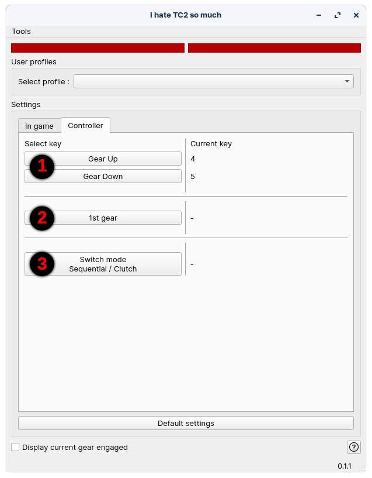

# Liens importants

- [Installation](#GUIDE-Install)
- [Utilisation](#GUIDE-Usage)
- [Problèmes connus (CPU Bloqué à 100%)](#FAQ-known-problems)


<!--MARKDOWN_INDEX_BEGIN-->
# Table des matières

**[Liens importants](#liens-importants)**<br/>
**[Qu'est-ce que c'est que cette chose là ?](#quest-ce-que-cest-que-cette-chose-là-)**<br/>
&emsp;*[Intro](#intro)*<br/>
&emsp;*[Et donc ?](#et-donc-)*<br/>
&emsp;*[Et le logiciel ?](#et-le-logiciel-)*<br/>
**[Installation](#installation)**<br/>
&emsp;*[Télécharger](#télécharger)*<br/>
&emsp;*[Installer](#installer)*<br/>
&emsp;*[Mises à jour](#mises-à-jour)*<br/>
**[Utilisation](#utilisation)**<br/>
&emsp;*[Configuration initiale](#configuration-initiale)*<br/>
&emsp;*[Configurer le jeu](#configurer-le-jeu)*<br/>
&emsp;&emsp;[Clavier](#clavier)<br/>
&emsp;&emsp;[Manette / Contrôleur](#manette--contrôleur)<br/>
&emsp;*[Configurer le logiciel](#configurer-le-logiciel)*<br/>
&emsp;&emsp;[Présentation de l'interface](#présentation-de-linterface)<br/>
&emsp;&emsp;[Configurer une touche](#configurer-une-touche)<br/>
&emsp;&emsp;[Configurer un bouton du contrôleur](#configurer-un-bouton-du-contrôleur)<br/>
**[FAQ](#faq)**<br/>
&emsp;*[Quels sont les périphériques supportés ?](#quels-sont-les-périphériques-supportés-)*<br/>
&emsp;*[A quoi sert chaque élément de l'interface ?](#a-quoi-sert-chaque-élément-de-linterface-)*<br/>
&emsp;*[Que faire en cas d'échec de mise à jour ?](#que-faire-en-cas-déchec-de-mise-à-jour-)*<br/>
&emsp;*[Problèmes connus](#problèmes-connus)*<br/>
<!--MARKDOWN_INDEX_END-->


# Qu'est-ce que c'est que cette chose là ?

## Intro

Ce logiciel est destiné à rendre le jeu *The Crew 2* un peu plus compétitif pour le plus de joueur possible.

La communauté s'est  acharnée à trouver des moyens de casser le jeu pour exploiter le plus possible les bugs, glitchs et faiblesses de celui-ci. Parmi ces techniques, l'une d'entre elle est désignée **"clutch"** qui permet de passer les vitesses instantanément. Cela donne une accélération folle à toutes les voitures 

Elle n'est cependant réservée qu'à une pseudo-élite qui veut perdre du temps à configurer *Steam Big Picture*, utiliser des logiciels comme *AntiMicroX* péniblent à configurer ou jouer au clavier (ou en avoir un à côté juste pour passer les vitesse). Sans compter que toutes ces techniques impliquent de choisir la vitesse à passer, plus de séquentiel ! Donc très contraignant.

Et peu importe à quel point ceux qui l'utilisent sont mauvais, cela leur donne un avantage extrêmement frustrant lorsque l'on voit le joueur zigzaguer en virage mais rester devant parce qu'il a une accélération ridiculement rapide.

## Et donc ?

Et donc, j'ai souhaité pouvoir rendre le **clutch** plus accessible. Puisque grâce à des petits génies comme ***Akkorrr*** (c'est ironique, ce type est détestable), le **clutch** est maintenant extrêmement répendu mais reste dédié à ceux qui ont envie de s'emmerder.

Tant qu'à avoir beaucoup de monde utilisant cette technique, autant faire en sorte de la rendre encore plus accessible histoire de rééquilibrer les chances pour ceux comme moi qui n'ont pas envie de jouer avec une main sur le clavier mais souhaitent tout de même pouvoir faire la course de manière plutôt équitable.

## Et le logiciel ?

Ce petit soft que j'ai développé vous permet donc de passer les vitesses en séquentiel en utilisant la technique **clutch** tout en étant simple à configurer **et** utiliser.

Pour savoir avec quels périphériques le logiciel est compatible, cf. [la FAQ](#FAQ-supported-controller)

<br/><br/>

<a name="GUIDE-Install"></a>
# Installation

## Télécharger

Vous pouvez télécharger l'installateur de la dernière version directement [ICI](https://github.com/brokenGameNoob/BrokenTC2/releases/latest/download/BrokenTC2_setup_x64.exe).

Ou vous rendre sur [la page des versions publiées](https://github.com/BrokenGameNoob/BrokenTC2/releases/latest/) et télécharger l'installateur de la dernière version.

Vous aurez également accès aux **informations liées à la dernière version publiée.**
<br/><br/>

## Installer

Une fois l'installateur téléchargé, il suffit de le lancer et suivre les instructions affichées à l'écran. Notez qu'il n'est pas nécessaire de l'exécuter en tant qu'administrateur par défaut pour l'installer.
<br/><br/>

## Mises à jour

Grand luxe ! Le logiciel cherche si des mises à jour sont disponibles à chaque lancement à partir de la [version 0.1.0](https://github.com/BrokenGameNoob/BrokenTC2/releases/tag/v0.1.0). Si une MAJ est disponible, il vous proposera de l'installer automatiquement.

A partir de la [version 0.1.1](https://github.com/BrokenGameNoob/BrokenTC2/releases/tag/v0.1.1), l'utilisateur peut demander à vérifier l'existence de mise à jour manuellement depuis le menu ***Tools*** du logiciel.

Lors d'une mise à jour, le logiciel va télécharger les fichiers nécessaires puis se fermer le temps de l'installation et se **relancer automatiquement en cas de succès**. En cas de problème de mise à jour, se référer à [la FAQ](#FAQ-update-failed)


<br/><br/>

<a name="GUIDE-Usage"></a>
# Utilisation

## Configuration initiale

Points importants:
- Une configuration est saauvegardée pour un contrôleur de jeu. Ce qui fait que vous pouvez faire plusieurs configurations en fonction du périphérique que vous utilisez pour jouer. **MAIS** vous devrez donc aussi re-définir les touches du clavier (on y vient) pour chaque nouveau contrôleur.
- On peut distinguer deux configurations : celle du clavier qui correspond aux paramètres définis IN-GAME. Et celle du contrôleur qui correspond aux boutons affectés sur la manette.
<br/><br/>


## Configurer le jeu
<br/>

| ⚠️        | Il est nécessaire que le jeu soit en "plein écran sans bordure" pour afficher la vitesse engagée par le logiciel       |
|-----------|:-----------------------------------------------------------------------------------------------------------------------|

<a name="settings-in-game-keyboard"></a>
### Clavier
<br/>

Il est avant tout nécessaire de configurer le jeu, vous pouvez donc le lancer.

Le but est ici de définir des touches correspondantes aux actions liées à la boîte manuelle. Une touche pour l'embrayage, une pour la marche arrière et une pour chaque vitesse. Une configuration classique est "0" pour l'embrayage, "1" à "7" pour les 7 vitesses et "8" pour la marche arrière.

Profitez d'avoir le jeu ouvert pour chercher quelles touches sont utilisées pour le passage de vitesse séquentiel des véhicules terrestres. Par défaut "A" pour rétrogader et "E" pour passer la vitesse.
<br/><br/>


### Manette / Contrôleur
<br/>

**J'assume pour la suite que vous souhaitez remplacer le passage de vitesse séquentiel de votre contrôleur par l'usage de BrokenTC2**.

Afin d'éviter tout conflit, la première étape pour cela est de ***supprimer l'affectation des boutons de votre contrôleur*** dans le jeu (en particulier si vous jouez avec une manette). Mais étant donné que *IVT* ne peut pas penser à tout, ce n'est pas possible directement en jeu. Je vous invite donc à fermer celui-ci et suivre la démarche suivante :

> ***Note :*** *On peut également simplement ré-affecter les touches dans le jeu si cette étape semble trop complexe. Elle ne nécessite cependant que quelques minutes*

Ouvrir l'explorateur de fichiers et vous rendre dans le dossier
> Documents/The Crew 2/

Cherchez ensuite dans ce dossier un fichier nommé à peu près de cette manière :
> Bindings_6cb1bec2.xml

Puis ouvrez-le avec un éditeur de texte comme le *bloc note*.

- Cherchez le texte `RoadGearUp` dans ce fichier à l'aide de **Ctrl+F**
- Vous devriez trouver quelque chose du genre
    ```xml
    <Action Name="RoadGearUp" IsAnalog="0">
        <Channel Device="PAD" Name="BUTTON9" />
    </Action>
    ```
- Vous n'avez qu'à supprimer la ligne du milieu
    ```xml
        <Channel Device="PAD" Name="BUTTON9" />
    ```
    Pour vous retrouver avec le contenu suivant :
    ```xml
    <Action Name="RoadGearUp" IsAnalog="0">
    </Action>
    ```
- et c'est fini pour celui-là ! Il faut maintenant répéter cette opération mais en cherchant le texte `RoadGearDown` (qui devrait être juste en dessous normalement)
<br/><br/>

## Configurer le logiciel

<br/>

<a name="GUI-presentation"></a>
### Présentation de l'interface

Voici la page que vous devriez voir lors du lancement du logiciel :


1. Ceci permet de voir quand est-ce que le logiciel détecte l'appui sur la touche pour rétrogader ou passer la vitesse. L'un des deux rectangle passera au vert de l'appui sur la touche.
2. C'est ici que vous pouvez sélectionner le contrôleur que vous souhaitez utiliser
3. L'onglet `In game` correspond aux touches configurées en jeu et le champ `Gear key press delay (ms)` correspond au temps durant lequel le logiciel va simuler l'appui sur une touche du clavier.
    > **Note :** La valeur par défaut est 20ms. Si vous avez souvent des ratés de passage de vitesse, vous pouvez augmenter la valeur jusqu'à ce que ça marche.
4. L'onglet `Controller` concerne les paramètres du contrôleur (les boutons utilisées pour les différentes actions)
5. Ceci permet d'afficher la vitesse actuellement engagée par la boîte séquentielle du jeu. Je **recommande** vivement d'activer ceci puisque en cas de lag ou de problème, la vitesse du logiciel et celle utilisée en jeu pourrait différer. L'afficher permet de s'en rendre compte

<br/>

### Configurer une touche

Il faut maintenant configurer chaque touche de l'onglet `In game` avec celles que vous avez paramétré [plus tôt](#settings-in-game-keyboard).

Pour affecter une touche, il suffit de cliquer sur le bouton correspondant. Une fenêtre va s'ouvrir et attender l'appui sur une touche pour l'utiliser.

<br/>

### Configurer un bouton du contrôleur

Rendez-vous dans l'onglet `Controller`. Suivez ensuite la même démarche pour les fonctions qui vous intéressent.



1. Monter / descendre les vitesses
2. Mettre directement la première vitesse
3. Changer de mode Séquentiel normal (du jeu) / Séquentiel clutch. Cela est utile pour les voitures avec 8 vitesses ou pour lesquelles le clutch est inutile ou contre-productif
    > ***Note :*** Lorsque en mode "Séquentiel normal", l'indicateur de rapport engagé est affiché en Rouge. Il est blanc lorsque le mode utilisé est "Séquentiel clutch"


<br/><br/>
# FAQ

<a name="FAQ-supported-controller"></a>
## Quels sont les périphériques supportés ?
N'importe quel contrôleur de jeu est supporté par le logiciel.

Cependant, il n'est pas possible de l'utiliser si vous jouez au clavier.
<br/><br/>


<a name="FAQ-interface"></a>
## A quoi sert chaque élément de l'interface ?
Se référer à [l'explication](#GUI-presentation)
<br/><br/>


<a name="FAQ-update-failed"></a>
## Que faire en cas d'échec de mise à jour ?
Dans le cas où le logiciel ne se relance pas automatiquement après avoir demandé une mise à jour, il y a de fortes chances que celle-ni n'aie pas été un succès.

Dans ce cas, je vous invite à prendre contact avec moi via la [section dédiée sur GitHub](https://github.com/BrokenGameNoob/BrokenTC2/issues) ou par mail [brokengamenoob@gmail.com](brokengamenoob@gmail.com)


<a name="FAQ-known-problems"></a>
## Problèmes connus
- *Utilisation du CPU à 100%*
    
    **Solution** : Activer le "Low performance mode" (dernière case à cocher en bas du logiciel depuis la version v0.1.2)
<br/><br/>
