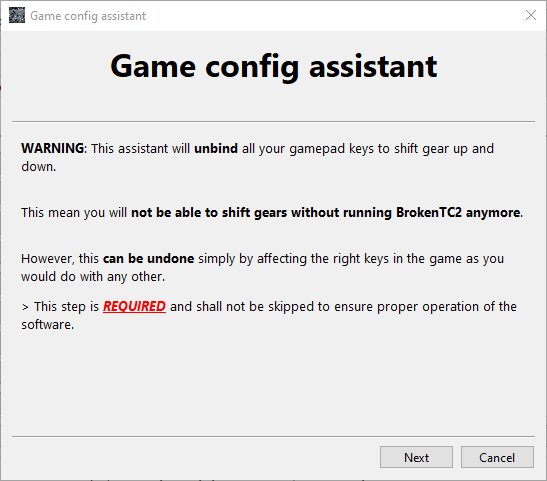
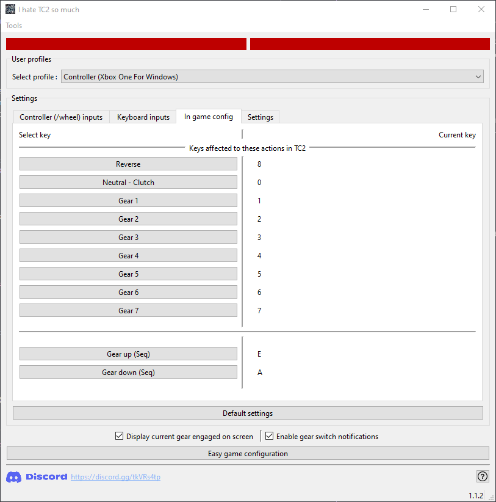
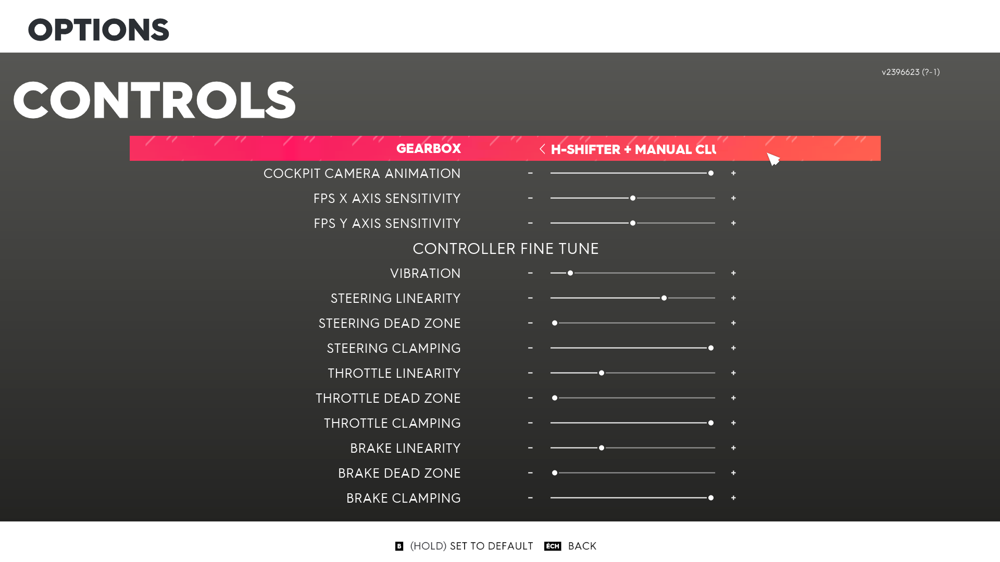

# Quick guide

> ***Note***: ⚠️ Use "clutch" mode **ONLY** for cars with up to 7 speeds. Otherwise, use "Sequential mode". You can configure a key or a controller button to switch between both ⚠️

> ***Note***: This software emulates keyboard inputs from the user

# Setup the game & the software

## 1. Install the software & run "Ez Setup"

 

Follow the instruction of the "Ez Setup"

 

## 2. Configure keys

 

The order of the following steps doesn't matter.

You just have to set the same keyboard keys for gears 1 to 7, reverse, clutch and gear up & down (those last two are in the tab "Ground vehicle") in both the clutch software and the game (check below for more information).

 

### In game keys

 

Set desired keyboard keys for gears 1 to 7, reverse, clutch and gear up & down in sequential (those last two are in the tab "Ground vehicle") (same keys as setup in the software (see just below)).

 

 

### Software Keys

 

Set in the tab "In game config" keyboard keys for gears 1 to 7, reverse, clutch and gear up & down in sequential (same keys as in the game).

 

 

## 3. Do not forget to set your In-Game gearbox to "H-Shifter + Clutch"

 

