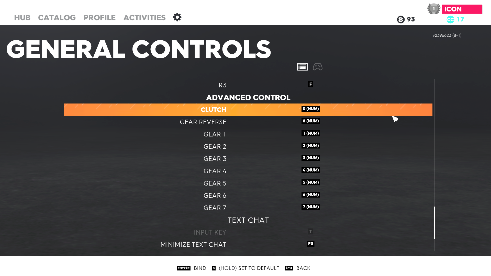

# Quick guide

> ***Note***: ⚠️ N'utiliser le mode "clutch" **que** avec les voitures ayant au plus 7 vitesses. Utilisez le mode "séquentiel" pout les autres. Vous pouvez configurer une touche ou un bouton de votre contrôleur pour switch de mode. ⚠️

> ***Note***: Ce logiciel ne fait qu'émuler des inputs clavier

# Configuration du jeu et du logiciel

## 1. Installez le logiciel et suiver l'assistant "Ez Setup"

 

Suivant les instructions s'affichant à l'écran

 

## 2. Configuration des touches

 

L'ordre dans lequel les actions suivantes sont réalisées n'importe pas.

Vous avez simplement à affecter les même touches In-Game et sur le logiciel pour les actions "Engager la vitesse" 1 à 7, marche arrière, embrayage et "Rapport supérieur" et "Rapport inférieur" (ces deux derniers se trouvant dans l'onglet "Véhicules sol").

 

### Configuration du jeu

 

Affectez les touches pour passer les vitesses 1 à 7, la marche arrière et l'embrayage de l'onglet "Général". Mais également les touches "Rapport supérieur" et "Rapport inférieur" de l'onglet "Véhicules sol".

Ces touches doivent être identiques à celles configurées dans le logiciel.

 

 

### Dans le logiciel

 

Configurez les touches de l'onglet "In game profile" pour correspondre à la configuration de votre jeu.

 

 

## 3. N'oubliez pas de changer votre boîte de vitesse In-Game en "Boîte de vitesse + embrayage"

## 4. Configurez les commandes souhaitées dans le logiciel

 

