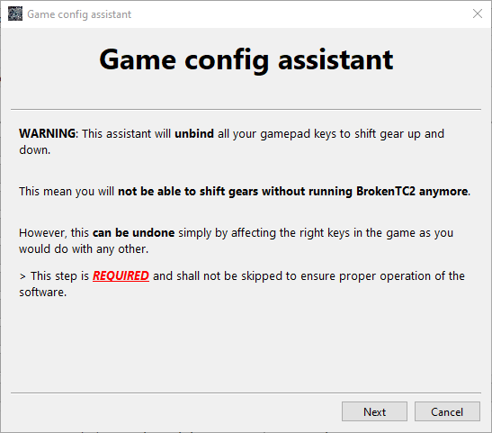
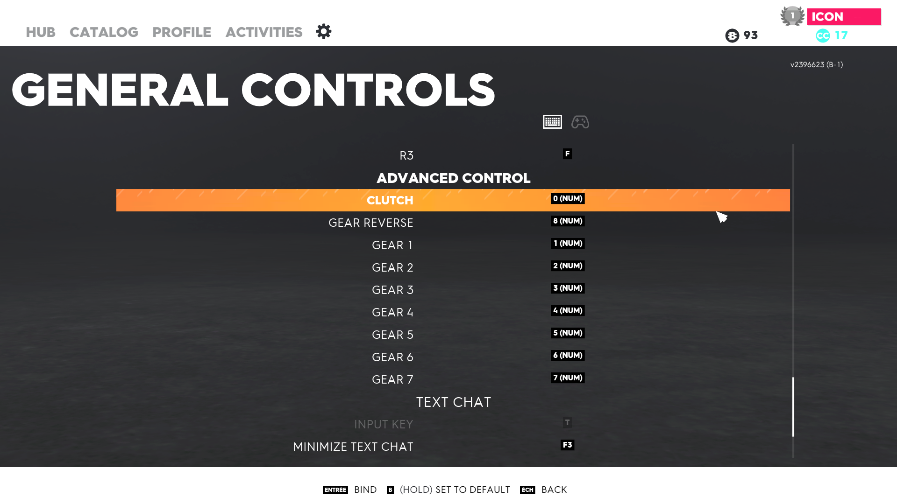
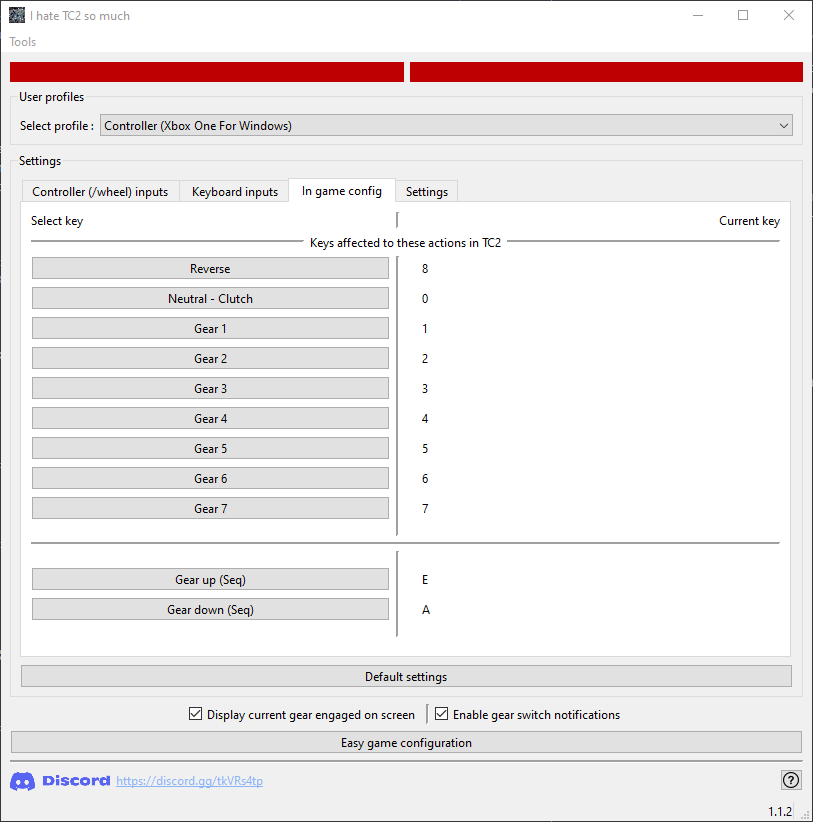
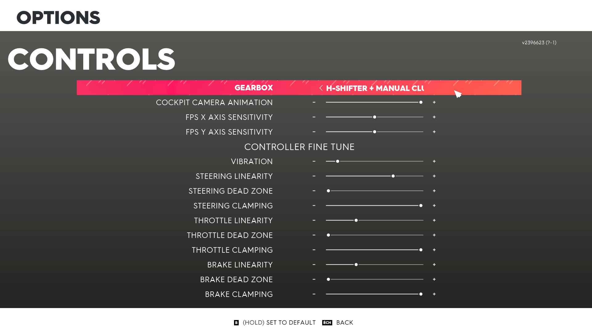
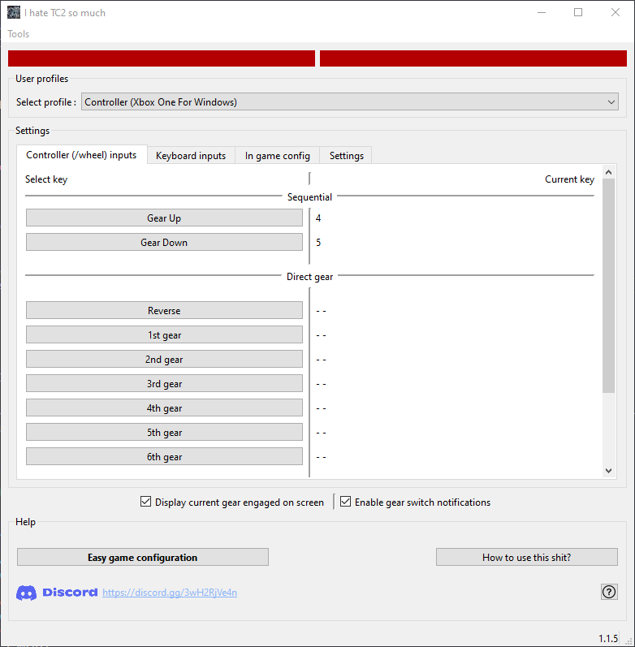

# Broken The Crew 2

<!-- .. -->

<!-- Badge help: -->
<!-- https://shields.io/category/size -->

 &nbsp;&nbsp; 

 
<!--  -->

## Features
- Sequential clutch (only 2 buttons required to go from Reverse to 7th gear as fast as possible)
- Current gear engaged by the software displayed on screen (allows to spot for differences between IG gear and BTC2 gear in case of shifting failure)
- Usable with wheels, controllers and pretty much anything recognized
- Profiles linked to controller in use
- Easy configuration and detailed instructions just below
- Secured automatic updates

## Download

[Click here to access release page](https://github.com/BrokenGameNoob/BrokenTC2/releases)

 

# Quick guide

Quick guide language:
- 🇫🇷 [Quick guide FR (Important !)](Docs/UserManual_fr.md)
- 🇬🇧 [Quick guide EN (Important!)](Docs/UserManual_en.md)

 

> ***Note***: ⚠️ Use "clutch" mode **ONLY** for cars with up to 7 speeds. Otherwise, use "Sequential mode". You can configure a key or a controller button to switch between both ⚠️

> ***Note***: This software emulates keyboard inputs from the user

# Setup the game & the software

## 1. Install the software & run "Ez Setup"

 

Follow the instruction of the "Ez Setup"

 

## 2. Configure keys

 

The order of the following steps doesn't matter.

You just have to set the same keyboard keys for gears 1 to 7, reverse, clutch and gear up & down (those last two are in the tab "Ground vehicle") in both the clutch software and the game (check below for more information).

 

### In game keys

 

Set desired keyboard keys for gears 1 to 7, reverse, clutch and gear up & down in sequential (those last two are in the tab "Ground vehicle") (same keys as setup in the software (see just below)).

 

 

### Software Keys

 

Set in the tab "In game config" keyboard keys for gears 1 to 7, reverse, clutch and gear up & down in sequential (same keys as in the game).

 

 

## 3. Do not forget to set your In-Game gearbox to "H-Shifter + Clutch"

 

## 4. Configure your controller settings

## Build

### SDL

Setup SDL by downloading the `SDL2-devel-{version}-mingw` package from [github/SDL](https://github.com/libsdl-org/SDL/releases)
Then extract the folder `x86_64-w64-mingw32` into `C:/Libs/` so that the final include directory for the SDL is `C:/Libs/x86_64-w64-mingw32/include`

## Misc

Installer download count

